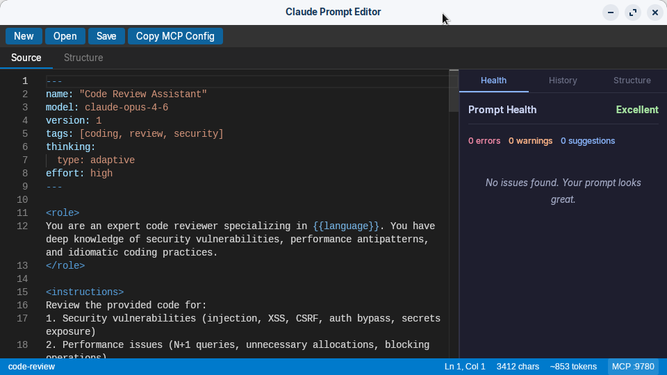
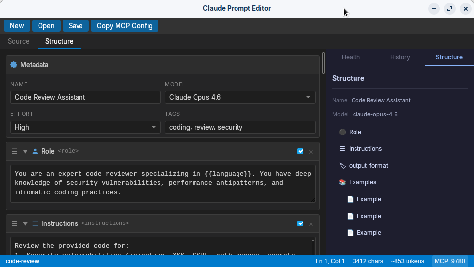

# Claude Prompt Editor

A lightweight desktop IDE for crafting, validating, and testing Claude API prompts following [Anthropic's best practices](https://platform.claude.com/docs/en/build-with-claude/prompt-engineering/claude-prompting-best-practices). Built with Tauri 2.0 (Rust + Svelte 5), distributed as a single binary for Linux and Mac.





## Features

**Dual-Mode Editor**
- **Source mode** — Monaco-based text editor with syntax highlighting for XML tags, YAML frontmatter, and `{{variable}}` interpolation
- **Structure mode** — Block-based visual editor where each XML section (role, instructions, examples, etc.) is a collapsible, reorderable card with enable/disable toggles

**Best Practices Linting**
- 10 built-in lint rules detect common prompt issues: missing role definitions, sparse examples, negative framing, over-prompting for Claude 4.6, vague instructions, and more
- Prompt Health panel shows real-time feedback with severity levels and fix suggestions

**Claude Code Integration (MCP)**
- Built-in MCP server (default port 9780) lets Claude Code load prompts directly from the editor
- Tools: `load_prompt`, `list_prompts`, `set_variable`, `get_prompt_health`
- No API key needed — prompts are tested through your existing Claude Code subscription

**Presets & Templates**
- 13 built-in presets (roles, constraints, output formats, example skeletons)
- 9 starter templates (blank and use-case specific: agentic, code assistant, data extraction, classification, research/RAG, conversational)
- Custom preset creation

**Version History**
- Auto-saves versions on every file save
- Visual diff between any two versions
- Restore previous versions, add annotations

## Requirements

- [Rust](https://rustup.rs/) (1.70+)
- [Node.js](https://nodejs.org/) (18+)
- [pnpm](https://pnpm.io/) (9+)
- Linux: `libgtk-3-dev`, `libwebkit2gtk-4.1-dev`, `libcairo2-dev`, `libpango1.0-dev`, `libgdk-pixbuf-2.0-dev`, `librsvg2-dev`
- Mac: Xcode Command Line Tools

## Quick Start

```bash
git clone git@github.com:midwire/claude-prompt-editor.git
cd claude-prompt-editor
pnpm install
pnpm tauri dev
```

The editor opens and the MCP server starts automatically on port 9780.

### Wayland

If you see a blank window or `GBM buffer` / `Protocol error` messages on Wayland, force compositing off:

```bash
WEBKIT_DISABLE_COMPOSITING_MODE=1 GDK_BACKEND=x11 pnpm tauri dev
```

## Claude Code Integration

To use prompts from the editor in Claude Code:

```bash
# One-time setup (while the editor is running)
claude mcp add claude-prompt-editor --transport http http://localhost:9780/mcp
```

Then in any Claude Code session:
```
> Use list_prompts to see available prompts
> Load the code-review prompt and use it to review this file
```

Or click **Copy MCP Config** in the editor toolbar and paste into your Claude Code config.

## Prompt File Format

Prompts are standard Markdown files with YAML frontmatter:

```markdown
---
name: "Code Review Assistant"
model: claude-opus-4-6
version: 1
tags: [coding, review]
thinking:
  type: adaptive
effort: high
---

<role>
You are an expert code reviewer specializing in {{language}}.
</role>

<instructions>
Review the provided code for security vulnerabilities and performance issues.
</instructions>

<examples>
<example>
<input>def login(u, p): return db.execute(f"SELECT * FROM users WHERE u='{u}'")</input>
<output>CRITICAL: SQL injection vulnerability...</output>
</example>
</examples>
```

## Environment Variables

| Variable | Default | Description |
|----------|---------|-------------|
| `MCP_PORT` | `9780` | MCP server port |
| `PROMPTS_DIR` | `./prompts` | Path to prompts directory |

## License

[MIT](LICENSE)
